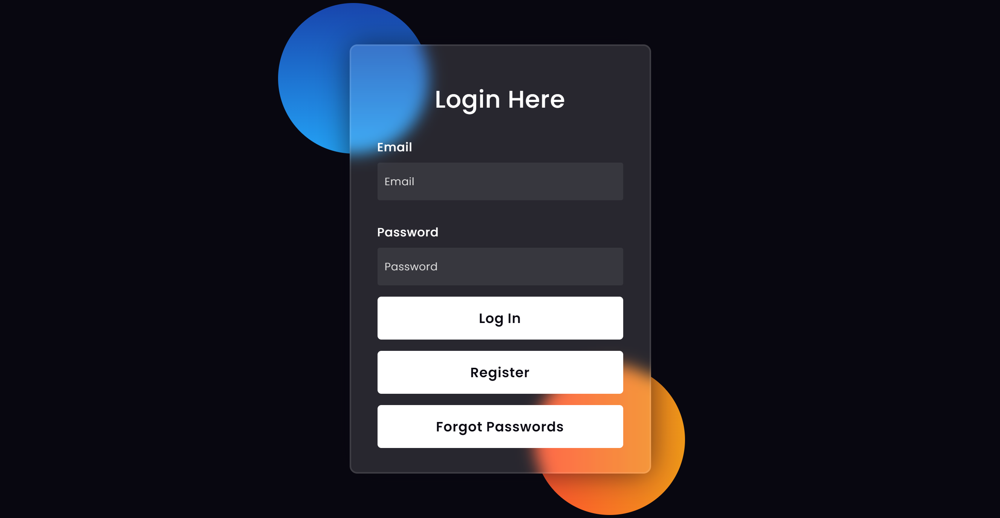
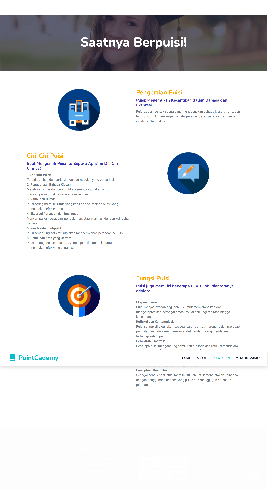
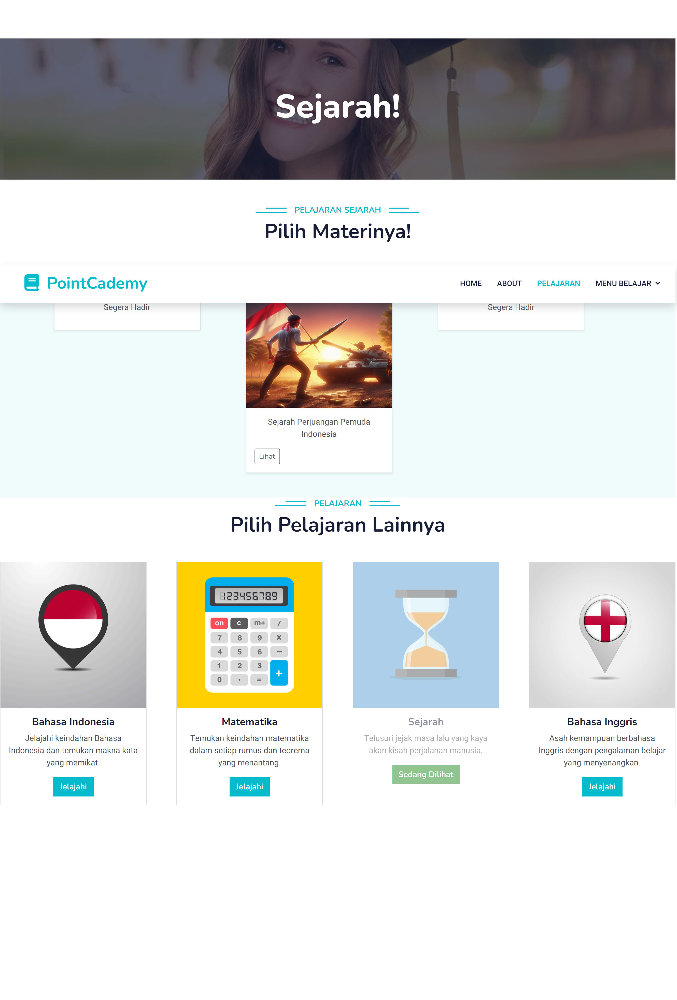
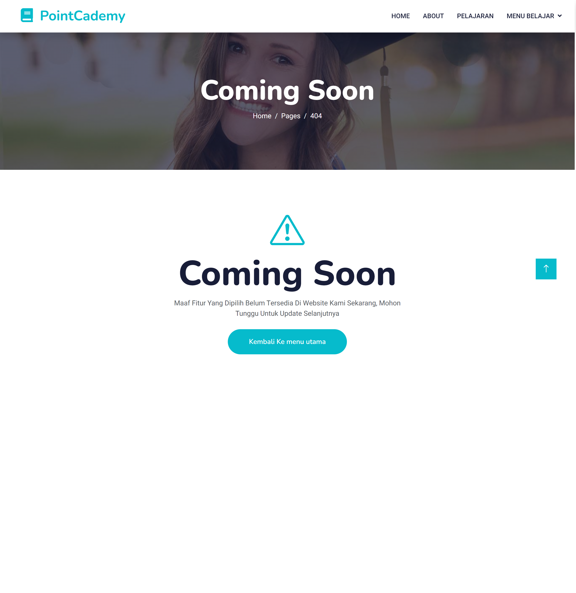

# Dokumentasi Proyek

Ini adalah dokumentasi untuk proyek pembuatan versi awal dari website PointCademy

## Instruksi Penggunaan

Jalankan dengan menggunakan vscode, dan gunakan live preview di halaman index.html,
daftar menggunakan alamat email lalu buat passwordnya, klik registrasi dan tunggu, website ini menggunakan firebase untuk login/registrasi
setelah ada pemberitahuan registrasi berhasil maka, lanjutkan login pada halaman yang sama, dan klik login

di halaman dashboard ada kalimat pembuka dan penjelasan singkat mengenai pointCademy
masuk ke halaman pelajaran, dan pilih salah satu jenjang (jenjang universitas belum tersedia sekarang)

kemudian pilih mata pelajaran yang sudah tersedia, (sekarang ada 4 mapel yaitu bahasa indonesia, mtk, sejarah, dan bahasa inggris)
pilih indonesia karena untuk sekarang baru itu yang tersedia materinya

untuk logout, klik menu belajar dan pilih logout.

## Kontribusi

kode ini dibuat oleh hacker dari tim Pointech---
